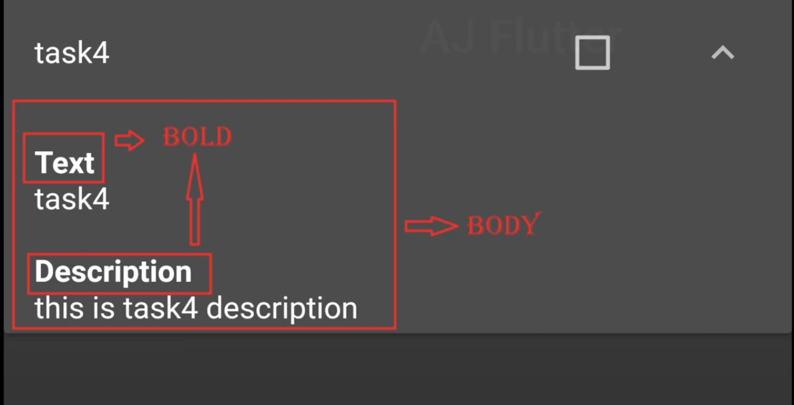

# flutter_task_app_test

A new Flutter project.
- [Youtube](https://www.youtube.com/watch?v=LSdmWNZhGbA&list=PL4KQIoSGkL6uRsAQqKRA-TrVfLIDV-Qcp&index=1)
## VS Code plugins
- [Data class generator](https://marketplace.visualstudio.com/items?itemName=ricardo-emerson.dart-data-class-tools)
- [Pub spec assist](https://marketplace.visualstudio.com/items?itemName=jeroen-meijer.pubspec-assist)

## cleanup 
```sh
sudo chmod -R 777 ~/dev/flutter-examples/flutter_tasks_app_bloc/build/ios

flutter clean
flutter pub get
cd ios
pod cache clean --all
rm -rf Pods
rm -rf ~/Library/Caches/CocoaPods
pod install --verbose
cd ..
cd android
./gradlew clean
cd ..
flutter pub get
flutter run
```

## Design
### Tasktile Layout

